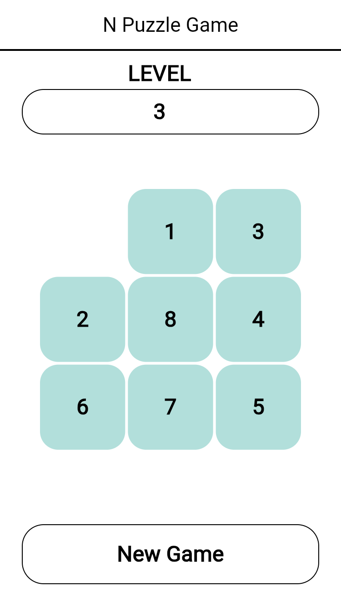
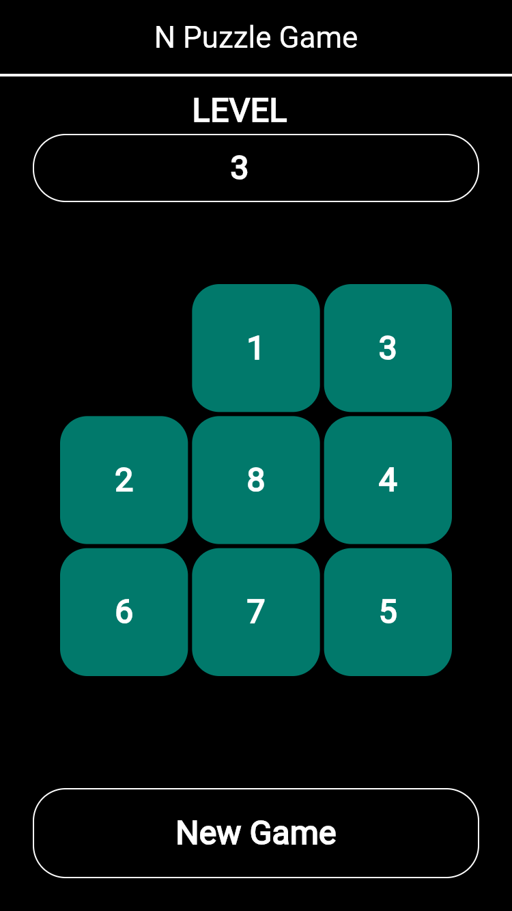

# 🧩 N-Puzzle Game (Flutter)

A beautiful and responsive implementation of the classic N-Puzzle game , built with Flutter.
Playable on web browsers platforms!

---
🔗 Link: [https://kstmasa.github.io/flutter-npuzzle/](https://kstmasa.github.io/flutter-npuzzle/)

---
✨ Features

•	🧩 Customizable grid sizes (3x3, 4x4, 5x5, and 6x6)

•	🌙 Dark Mode support

•	📱 Responsive UI for mobile, web, and desktop

---
📸 Screenshots

|  Light Mode   | Dark Mode  |
|  ----  | ----  |
|   |  |

---
🤝 Contributing

Contributions, issues, and feature requests are welcome!
Feel free to check issues page if you want to contribute.